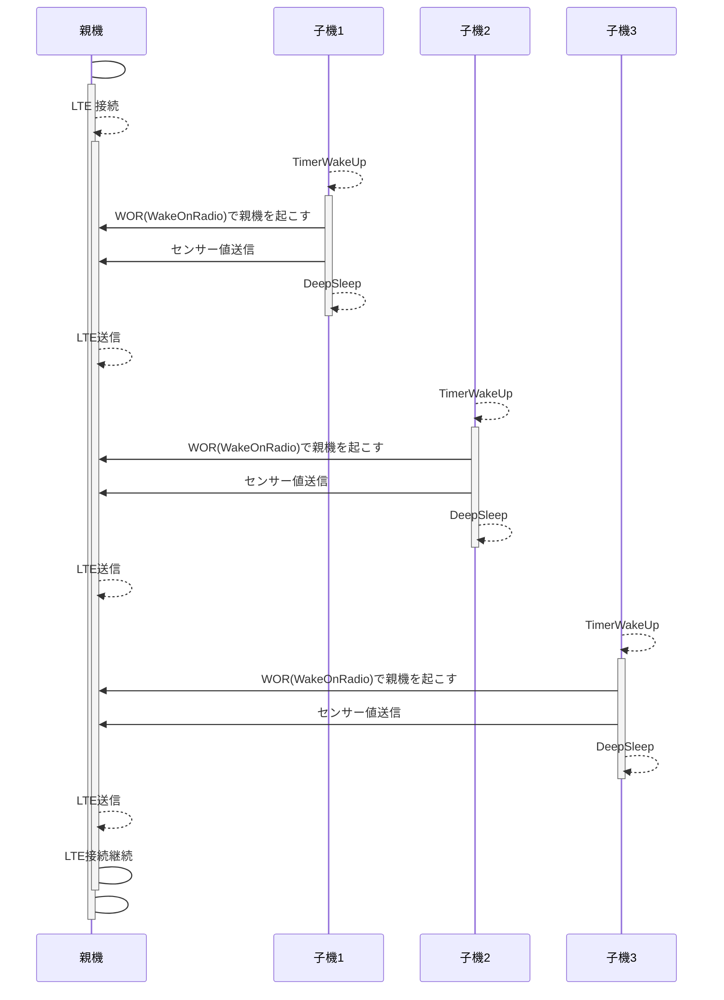
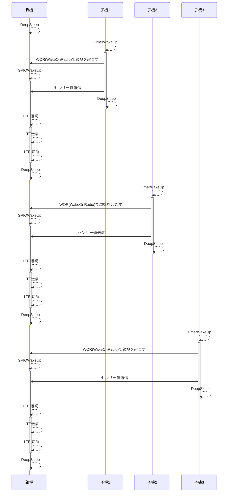
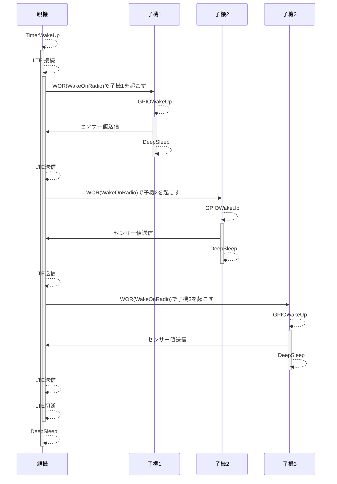

# LoRa-LTE GateWay

#### 1. 親機は常に子機を待ち受けてLTEも常時接続

```mermaid
sequenceDiagram
    親機　->+ 親機 :  
    親機　-->>+ 親機 : LTE 接続 
　　子機1 -->>+ 子機1 : TimerWakeUp
    子機1 ->> 親機 : WOR(WakeOnRadio)で親機を起こす
    子機1 ->> 親機 : センサー値送信
    子機1 -->>- 子機1 : DeepSleep
    親機 -->> 親機 : LTE送信
　　子機2 -->>+ 子機2 : TimerWakeUp
    子機2 ->> 親機 : WOR(WakeOnRadio)で親機を起こす
    子機2 ->> 親機 : センサー値送信
    子機2 -->>- 子機2 : DeepSleep
    親機 -->> 親機 : LTE送信
　　子機3 -->>+ 子機3 : TimerWakeUp
    子機3 ->> 親機 : WOR(WakeOnRadio)で親機を起こす
    子機3 ->> 親機 : センサー値送信
    子機3 -->>- 子機3 : DeepSleep
    親機 -->> 親機 : LTE送信
    親機　->- 親機 : LTE接続継続
    親機　->- 親機 :  
```

#### 2. 親機は子機に起こされるたびにLTEに接続して送信

```mermaid
sequenceDiagram
    親機　-->> 親機 : DeepSleep
　　子機1 -->>+ 子機1 : TimerWakeUp
    子機1 ->> 親機 : WOR(WakeOnRadio)で親機を起こす
    親機  -->>+ 親機 : GPIOWakeUp  
    子機1 ->> 親機 : センサー値送信
    子機1 -->>- 子機1 : DeepSleep
    親機　-->>+ 親機 : LTE 接続 
    親機 -->> 親機 : LTE送信
    親機　-->>- 親機 : LTE 切断
    親機  -->>- 親機 : DeepSleep  
　　子機2 -->>+ 子機2 : TimerWakeUp
    子機2 ->> 親機 : WOR(WakeOnRadio)で親機を起こす
    親機  -->>+ 親機 : GPIOWakeUp  
    子機2 ->> 親機 : センサー値送信
    子機2 -->>- 子機2 : DeepSleep
    親機　-->>+ 親機 : LTE 接続 
    親機 -->> 親機 : LTE送信
    親機　-->>- 親機 : LTE 切断
    親機  -->>- 親機 : DeepSleep 
　　子機3 -->>+ 子機3 : TimerWakeUp
    子機3 ->> 親機 : WOR(WakeOnRadio)で親機を起こす
    親機  -->>+ 親機 : GPIOWakeUp  
    子機3 ->> 親機 : センサー値送信
    子機3 -->>- 子機3 : DeepSleep
    親機　-->>+ 親機 : LTE 接続 
    親機 -->> 親機 : LTE送信
    親機　-->>- 親機 : LTE 切断
    親機  -->>- 親機 : DeepSleep 

```

#### 3. 親機が定期的に子機を起こして終わったらSleep

```mermaid
sequenceDiagram
    親機　-->>+ 親機 : TimerWakeUp
    親機　-->>+ 親機 : LTE 接続 
    親機 ->> 子機1 : WOR(WakeOnRadio)で子機1を起こす
    子機1 -->>+ 子機1 : GPIOWakeUp
    子機1 ->> 親機 : センサー値送信
    子機1 -->>- 子機1 : DeepSleep
    親機 -->> 親機 : LTE送信
    親機 ->> 子機2 : WOR(WakeOnRadio)で子機2を起こす
    子機2 -->>+ 子機2 : GPIOWakeUp
    子機2 ->> 親機 : センサー値送信
    子機2 -->>- 子機2 : DeepSleep
    親機 -->> 親機 : LTE送信
    親機 ->> 子機3 : WOR(WakeOnRadio)で子機3を起こす
    子機3 -->>+ 子機3 : GPIOWakeUp
    子機3 ->> 親機 : センサー値送信
    子機3 -->>- 子機3 : DeepSleep
    親機 -->> 親機 : LTE送信
    親機　-->>- 親機　: LTE切断
    親機　-->>- 親機　: DeepSleep


```